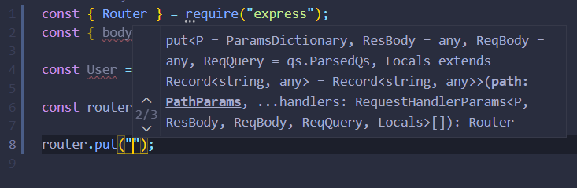
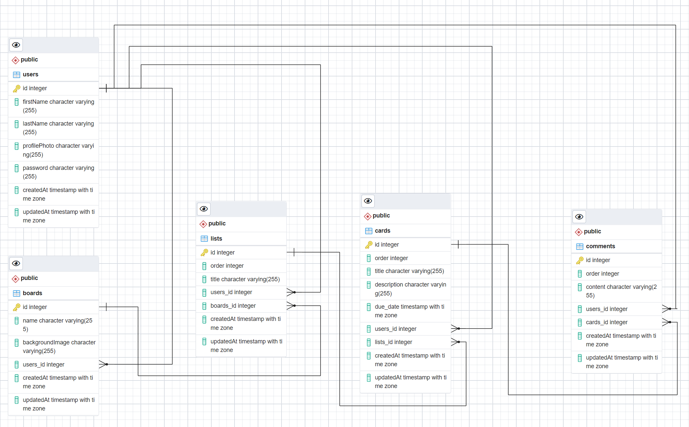

# Weclome to my Kanban board

Project Details

 

# How to run locally?

### backend

> `npm i && npm db:up && npm run dev`

### frontend

> `npm i && npm run dev`

# TO DO

- [x] Define database schema
- [ ] Build Routes
- [ ] Create all CRUD methods
- [ ] Test backend with Postman
- [ ] Deploy database to AWS? or keep locally? do both?
- [ ] Add stickers to project

# Questions

- **frontend** &#8594; Header.js -> why does this work (e, { name, path }), but not this ({ name, path })????
- **database** &#8594; How to think about mapping database schema to REST API? Should be thinking more about what the frontend will want to request / how user will use the app? Do I want a route for every table for CRUD operations?
- **database** &#8594; is this a legit URI: postgres://${user}:${password}@${host}:${port}/${database}? whats the go with postgres://
- **database** &#8594; direction of database associations? a comment has a single user, or a user has many comments? which table to define assocations?
- **database** &#8594; Should I be using UUID's or just incrementing ids to unique define rows?
- **javascript** &#8594; How to interpret / understand / find documentation on vscode hints like this 

# Useful Links

[Express Docs](http://expressjs.com/en/api.html#app.use)  
[Realational Database Schematic](https://dbdiagram.io/)  
[node-postgres docs](https://node-postgres.com/features/connecting)  

Tech overview

 

# Database Schema

# Routes

# Technologies I want to use

- React
- Cypress Testing
- Semantic UI
- SASS
- eslint / prettier
- firebase / cognito
- nodejs backend
- circle CI
- postgres database
- Postman testing
- error logging - sentry?
- secrets manager - aws?

 
